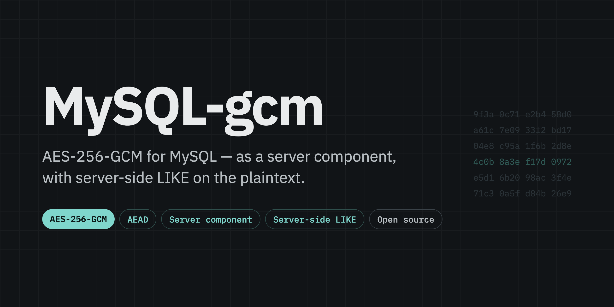

<p align="center">
  
</p>

<p align="center">
  <a href="README.md">English</a> · <a href="README-KO.md">한국어</a>
</p>

<p align="center">
  
  
  
  
  <a href="LICENSE"></a>
</p>

`gcm_encrypt`, `gcm_encrypt_det` and `gcm_decrypt` are registered as a MySQL **component** (not a
legacy UDF plugin). The decrypted value is charset-tagged `utf8mb4`, so MySQL's own collation drives
`LIKE '%길%'` **inside the server** — keeping partial-match search on encrypted columns, which is the
reason this project exists. The measured workloads compare its cost with the `AES_DECRYPT` builtin;
the result depends on the hardware, suite and workload. See [Performance](#performance).

> **Status: ready to tag 0.1.0.** Builds in-tree against MySQL 8.0, 8.4 and 9.x and passes the unit
> and integration suites on all three majors in CI, plus MTR, E2E and load on 8.4. The envelope format is frozen
> (`spec/envelope.md`), the load gate is set from three measured runs on CI hardware, and the release
> pipeline has been dry-run end to end — six artifacts, all three server images started and queried,
> checksums signed and the signature verified independently. **Nothing is published yet**: no tag, so
> no GitHub Release and no Docker Hub tags. The standing caveat is unchanged — **no independent
> cryptographic review** (constraint 13).

## Read this first — operational constraints

These are properties of the approach, not a bug list, and none of them can be fixed by the component.
Full text and rationale: `docs/ops-constraints.md` and `docs/design.md` §6 with amendments A7, A8.

| Theme | Constraints |
|---|---|
| **Topology** — replication, promotion, sharding | 1, 14, 15 |
| **Keys and nonces** — budget, rotation, AAD policy, recovery | 7, 11, 12 |
| **Query behaviour** — optimizer, what determinism leaks | 5, 6 |
| **Data and versions** — legacy envelopes, charset, sysvar scope, argument shape | 8, 9, 10 |
| **Environment** — logs, managed services, my.cnf | 2, 3, 4 |
| **Scope of assurance** — what is checked and what is not | 13 |

1. **`gcm_encrypt` is non-deterministic**, so **ROW binlog is required**. Under statement-based
   replication a replica would compute a different nonce. Non-deterministic functions also cannot be
   used in generated columns or indexes.
2. **Keys and plaintext are SQL arguments**, so they can reach the general log, the slow log,
   `performance_schema.events_statements_*` and an SBR binlog. Search patterns like `'%김%'` are
   plaintext fragments too. This is the same exposure as `AES_ENCRYPT`; control log access.
3. **Self-managed MySQL only.** Managed services (RDS, Aurora, Cloud SQL) do not expose `plugin_dir`.
4. **Use `loose_` in my.cnf** (`loose_gcm.strict=ON`). Without the prefix the server refuses to start
   before the component is installed.
5. **The functions are opaque to the optimizer.** `WHERE gcm_decrypt(col, @k) LIKE '%김%'` scans the
   candidate set; selectivity has to come from other predicates.
6. **`gcm_encrypt_det` reveals equality of plaintexts.** It exists for join keys, UNIQUE constraints
   and exact-match lookups. Never use it for free text. It also costs **3.5–5x a plain seal** — two
   HMAC passes for the nonce, not the cipher — while decryption costs the same either way
   (`docs/perf.md`).
7. **One AAD convention per key.** `gcm_encrypt_det` derives its nonce from the plaintext alone, so
   the same plaintext under one key with two different AADs reuses a (key, nonce) pair and lets an
   observer of both values forge tags for that nonce. All deterministic calls using that key must
   use identical AAD bytes (or always empty AAD), across every server, column and application.
   Different AAD domains require different keys; ciphertext equality joins require the same key and AAD.
8. **Legacy `0x01` (CBC) envelopes are accepted but unauthenticated, and their plaintext must
   already be UTF-8.** Dual-read exists to migrate; a wrong key can return garbage rather than an
   error. Reject `0x01` once the migration is done. Because the result is tagged `utf8mb4` for every
   version and a v1 envelope never passed through the converting encryption path, a latin1 `Müller`
   returns as ill-formed bytes and `LIKE '%ller%'` silently yields 0. Convert the legacy column to
   `utf8mb4` before prefixing `0x01 || iv`. The conversion only applies to *character* arguments, so
   `gcm_encrypt(UNHEX('ff'), @k)` produces an ill-formed result on `0x02`/`0x03` too — encrypt text,
   not raw bytes, if the value has to be searchable.
9. **`gcm.strict` has no SESSION scope before MySQL 9.0.** Component system variables gained session
   scope in 9.0.0, so on 8.0 and 8.4 it is GLOBAL-only and `SET SESSION gcm.strict` is rejected by
   the server. The ON/OFF semantics are the same everywhere.
10. **Pass a stored value, not a freshly computed expression.** MySQL 8.0 and 8.4 hand a loadable
    function a stale view of some computed string arguments from the second row of a statement on, so
    `gcm_encrypt_det(CONCAT(name, id), @k)` can silently seal the wrong bytes. A column, a literal, a
    user variable or a bound parameter is always safe — that is what a driver sends. If you must
    compute in SQL, write the value into a **real table** first and call the function on the stored
    column: a *derived* table is merged back into the outer query by default and does not help.
    `CAST` alone is not enough either. Details and the per-version measurements:
    `docs/design.md` amendment A7.
11. **Define a per-key usage budget and rotation plan before deployment.** Account for encryption
    across all servers, columns and applications sharing a key. Have the limits reviewed for the
    nonce mode, message sizes and acceptable risk; this project has not established a universal
    safe usage limit. The component does not track usage or rotate keys. Rotation changes
    deterministic ciphertexts, so plan JOIN/UNIQUE migrations and retain access to keys needed by backups.
12. **Treat retries and recovery as part of nonce management.** Copying or restoring an existing
    envelope is not a new encryption. Calling `gcm_encrypt` again creates a fresh random nonce;
    deterministic retries reproduce the result only with the same key, plaintext and AAD. Never
    change only the AAD for a deterministic retry. Do not roll back key-usage accounting with a
    database restore. If cumulative usage or RNG-state safety is uncertain after recovery or process
    cloning, stop new writes with that key. Restore and verify safe RNG state across all writers
    before resuming with a freshly and independently generated key; key replacement alone does not
    repair duplicated RNG state.
13. **Security rules are not runtime monitoring.** The component validates inputs and authentication
    tags, but does not detect nonce reuse, enforce a cross-call AAD policy, or enforce key-usage limits.
    Development guard hooks restrict agent commands; they do not monitor production encryption.
    Deterministic encryption leaks equality, frequency and length; passing vectors or sampled
    collision tests is not a security proof. Review this construction and its deployment assumptions
    independently before production use. See [NIST SP 800-38D, §8 and Appendices A/B](https://nvlpubs.nist.gov/nistpubs/Legacy/SP/nistspecialpublication800-38d.pdf).
14. **Installing the component is not replicated.** `INSTALL COMPONENT` writes to one server's
    `mysql.component` and nowhere else. Install it on every server that answers decryption queries
    and on every replica that could be promoted, and make sure the application can supply the key
    there too. ROW binlog carries the ciphertext, nonce and tag as bytes, so a replica never
    re-encrypts — which is what makes replication safe here, and also why the replica still needs the
    component to *read* those values. MySQL reference:
    [replication formats](https://dev.mysql.com/doc/refman/8.4/en/replication-formats.html),
    [component loading](https://dev.mysql.com/doc/refman/8.4/en/component-loading.html).
15. **Sharding: route on a stable identifier, never on ciphertext.** A random-nonce value differs on
    every call, so it cannot be a routing key; a deterministic value is stable, but using it as the
    shard key turns key rotation into a resharding job. Moving rows between shards needs no
    re-encryption — the destination decrypts with the original key and AAD. Comparing deterministic
    ciphertext across shards requires the same key, plaintext *and* AAD, so item 7 applies across
    shard boundaries. Count new encryption calls across every shard that shares a key; copying
    existing ciphertext is not a new encryption. `gcm_decrypt(...) LIKE '%김%'` cannot select a shard
    on its own: without a routing predicate every shard is queried and each decrypts its own
    candidates. Whether a given sharding proxy forwards loadable-function calls and preserves the
    result charset has to be verified with that combination — this project validates self-managed
    MySQL servers only.
16. **A truncated key silently selects a weaker cipher unless `gcm.min_key_bytes` stops it.** The
    key length picks the suite — 32 bytes is AES-256-GCM, 24 is AES-192, 16 is AES-128 — so a
    32-byte key truncated by a client bug, a mis-set environment variable or a mis-sliced buffer is a
    *valid* key for a weaker suite, and `gcm_encrypt` seals with it and reports success at a strength
    nobody asked for. `gcm.min_key_bytes` is GLOBAL and defaults to `32`, which refuses exactly that;
    leave it alone unless you intend to use a smaller suite. It is an administrator policy, not a session setting, and
    lowering it on a server that hosts several applications removes the guard for all of them.
    Decryption never consults it, so raising it again cannot lock out data written while it was
    lower. A wrong key length on decryption reports that the envelope and the key disagree — that is
    not evidence of truncation, since a corrupted version byte gives the same error. A floor of 24
    permits AES-192 and AES-256 while refusing AES-128.

## Support matrix

| MySQL | Built and tested against | `gcm.strict` scope | Constraint 10 reproduces for |
|:--|:--|:--|:--|
| **8.0** | 8.0.43 | GLOBAL | `REPEAT(str, int_col)`-shaped arguments |
| **8.4** | 8.4.11 | GLOBAL | `CONCAT(str, int_col)`-shaped arguments |
| **9.x** | 9.4.0 | GLOBAL **+ SESSION** | neither shape |

Patch versions, image digests and source checksums live in `docker/versions.json`. A component links
against the server it was built for: **one artifact per MySQL major, per architecture.**

## Install

```sh
scripts/verify.sh 8.4          # build, install, and replay the integration scenarios
```

Or take the published server image, which is an official `mysql` image with the component already
in `plugin_dir` and installed on first start:

```sh
docker run -d -e MYSQL_ALLOW_EMPTY_PASSWORD=1 \
  devgyurak/mysql-gcm-server:mysql8.4 --loose_gcm.strict=ON --binlog-format=ROW
```

Tags are `<version>-mysql<major>` and `mysql<major>` (multi-arch, amd64 + arm64). There is no
`latest`: which major it would mean is ambiguous. The init step only runs on a **fresh** data
directory — against an existing volume, run `INSTALL COMPONENT 'file://component_gcm'` yourself, and
remember that it is per server (constraint 14).

That is the fast path. The individual steps:

```sh
scripts/build-in-docker.sh 8.4            # -> build/8.4/component_gcm.so
docker cp build/8.4/component_gcm.so mysql-dev-8.4:"$(
  docker exec mysql-dev-8.4 mysql -uroot -N -e 'SELECT @@plugin_dir')"/component_gcm.so
docker exec mysql-dev-8.4 mysql -uroot -e "INSTALL COMPONENT 'file://component_gcm'"
```

`plugin_dir` differs between images (`/usr/lib64/mysql/plugin/` on the Oracle Linux based ones), so
ask the server rather than hardcoding it.

### Verifying a release download

A release carries six tarballs (three majors x amd64/arm64), `SHA256SUMS`, a signature and
certificate for it, and an SPDX SBOM (covered by the checksums too). The signature is keyless, so
what you verify is *which workflow, in which repository, at which ref produced the checksums* —
there is no long-lived key of ours to trust or to leak. Keep the `@refs/tags/v` part of the identity:
without it the same command would also accept a signature this repository produced on a branch,
including a release dry run:

```sh
gh release download v0.1.0 -R devgyurak/mysql-gcm
cosign verify-blob --certificate SHA256SUMS.pem --signature SHA256SUMS.sig \
  --certificate-identity-regexp '^https://github\.com/devgyurak/mysql-gcm/\.github/workflows/release\.yml@refs/tags/v' \
  --certificate-oidc-issuer https://token.actions.githubusercontent.com SHA256SUMS
sha256sum -c SHA256SUMS
tar xzf component_gcm-0.1.0-mysql8.4-amd64.tar.gz     # -> component_gcm.so
```

Then copy the `.so` into that server's `plugin_dir` and install it, as above. Match the major: a
component built for 8.4 does not load into 9.x.

## Functions

| Function | Envelope | Returns | Use it for |
|:--|:--|:--|:--|
| `gcm_encrypt(plaintext, key [, aad])` | `0x02` / `0x04` / `0x06` — random 96-bit nonce | `BLOB` | everything that is only read back |
| `gcm_encrypt_det(plaintext, key [, aad])` | `0x03` / `0x05` / `0x07` — synthetic nonce | `BLOB` | join keys, `UNIQUE`, exact match |
| `gcm_decrypt(ciphertext, key [, aad])` | reads `0x01`–`0x07` | `VARCHAR` tagged `utf8mb4` | reading, and `LIKE` on the plaintext |

`key` must be **32 bytes (AES-256), 24 (AES-192) or 16 (AES-128)**; any other length is an error on
*every* call.
The `AES_ENCRYPT` key-folding behaviour is deliberately not reproduced. Tag verification failure
raises an error while `gcm.strict` is ON (the default) and returns NULL when it is OFF — a malformed
envelope or a wrong key length is *always* an error, because `gcm.strict=OFF` must never hide
corruption.

**The key length selects the cipher, and nothing else does** (`docs/design.md` amendment A10):

| Key | Suite | `gcm_encrypt` | `gcm_encrypt_det` |
|---:|:--|:--|:--|
| 32 B | AES-256-GCM | `0x02` | `0x03` |
| 24 B | AES-192-GCM | `0x06` | `0x07` |
| 16 B | AES-128-GCM | `0x04` | `0x05` |

The layout is identical — plaintext + 29 bytes in every case — and on decryption the version byte
states the key length it needs, so a mismatch is reported as a key error rather than as a failed tag.

That has a cost, which is why **anything below AES-256 is off by default**. A 32-byte key truncated in
transit is a *valid* 24- or 16-byte key, and without a floor `gcm_encrypt` would seal with it and
report success at a strength nobody asked for. `gcm.min_key_bytes` (GLOBAL, default `32`) is that
floor: leave it alone and the server behaves exactly as it did before, refusing short keys. Set it to
`24` to allow AES-192, or `16` to allow both smaller suites. Decryption ignores it entirely, so
raising the floor again never locks out data that was written under a lower one.

```sql
SET @k = UNHEX('000102030405060708090a0b0c0d0e0f101112131415161718191a1b1c1d1e1f');  -- fixture key

INSERT INTO patients (name_enc) VALUES (gcm_encrypt('홍길동', @k));
SELECT id FROM patients WHERE gcm_decrypt(name_enc, @k) LIKE '%길%';   -- server-side partial match
```

### Envelope

Normative byte layout, failure codes and test vectors: **`spec/envelope.md`**.

```
0x02  random nonce  ·  0x03  deterministic                    total = plaintext + 29 bytes
┌─────────┬───────────────────┬──────────────────────┬──────────────────┐
│ version │ nonce             │ ciphertext           │ tag              │
│ 1       │ 12                │ n                    │ 16               │
│ 02 / 03 │ RAND_bytes / HMAC │ AES-256-GCM          │ GCM, 128-bit     │
└─────────┴───────────────────┴──────────────────────┴──────────────────┘
  deterministic nonce = HMAC-SHA256(HMAC-SHA256(key, "mysql-gcm/v1/det-nonce"), plaintext)[0..12)

0x01  legacy CBC, decrypt only, NOT authenticated              total = 17 + 16k bytes
┌─────────┬───────────────────┬─────────────────────────────────────────┐
│ 01      │ IV 16             │ AES-256-CBC + PKCS#7        (no tag)    │
└─────────┴───────────────────┴─────────────────────────────────────────┘
  a migration prefixes an existing AES_ENCRYPT value — no re-encryption (constraint 8)
```

## Performance

Measured on a GitHub-hosted `ubuntu-24.04` runner against MySQL 8.4.11, 2026-10-02, over 300,000 rows
of which 29,918 match `'%김%'`. Ratios help compare runs, but both ratios and absolute times can vary
with hardware and workload. Re-measure where you plan to deploy.

### Server-side decrypt and partial match

The question this component exists to answer: is filtering an encrypted column inside the server fast
enough to use?

| Rows | Sessions | `gcm_decrypt(col) LIKE` p95 | `AES_DECRYPT(col) LIKE` p95 | ratio |
|---:|---:|---:|---:|---:|
| 300,000 | 1 | 255 ms | 269 ms | **0.95** |
| 300,000 | 8 | 1,073 ms | 1,154 ms | **0.93** |
| 300,000 | 32 | 4,172 ms | 4,555 ms | **0.92** |

The **slowest** of three consecutive runs, with each pair taken from that same run rather than
assembled from the best of each. `docs/design.md` §1.2 estimated ~1.1 s just to pull 100,000 candidate
rows into the application and decrypt them there; the same filter runs server-side in 255 ms.

`Created_tmp_disk_tables` did not move in any run at any session count — the question
`docs/design.md` §5.3 raised about plaintext reaching disk-based temporary tables. That is an
observation about this workload, not a guarantee: a query that adds a sort or a large grouping can
still spill.

### What the deterministic variant costs

`gcm_encrypt_det` is for join keys, `UNIQUE` constraints and exact-match lookups (constraint 6). It is
also several times more expensive to **write**, and the cost is the HMAC its nonce needs, not the
cipher — worth knowing before putting it on a write-heavy column.

| Plaintext | `gcm_encrypt` | `gcm_encrypt_det` |
|---:|---:|---:|
| 16 B | 2.7–3.2x | 4.9x |
| 256 B | 2.6–3.0x | 4.7–4.8x |
| 4 KiB | 1.6–1.8x | 4.0x |
| 64 KiB | 1.07x | 3.6x |

Relative to a plain AES-256-GCM seal, range over three runs. `gcm_encrypt`'s share is a constant
~450 ns for `RAND_bytes(12)` — the price of a fresh nonce, dominant on a short value and invisible on a
long one. `gcm_encrypt_det` pays two HMAC-SHA256 passes instead (`spec/envelope.md` §3), which do not
amortise the same way. **Whether that ratio rises or falls with size depends on the CPU**: these runs
fall from 4.9 to 3.6, and a runner with faster AES went the other way, 5.6 to 9.7. Decryption costs the
same for either variant.

### Does a smaller suite buy anything?

Little on a small value, and somewhat more on a large one. Over four CI core runs, the AES-192 and
AES-128 ratios to AES-256 ranged 0.978–1.022 at 16 bytes and 0.961–1.009 at 256 bytes; the advantage
grows with the value until AES-128 decryption is 7–14% cheaper at 64 KiB, the widest value observed on
the fastest runner, for a cause these runs did not isolate. The deterministic variant stays close to
1.0 at every size, consistent with a cost dominated by HMAC, which the key length does not touch.

At the SQL level, three CI runs per suite over 300,000 rows put every suite's `gcm_decrypt(col) LIKE`
p95 at 0.84–0.93 of `AES_DECRYPT` at 8 and 32 sessions and 0.75–0.96 at one, with the three suites'
ranges overlapping. The runs each land on a different hosted machine, so the milliseconds rank the
runners rather than the suites, and three runs bound the spread without proving the suites equal.

Keep AES-256 as the default recommendation. Use a smaller suite when the security and interoperability
requirements permit it, and measure the intended workload before making a performance trade-off.
Run links and the full tables are in `docs/perf.md`.

Both gates, the original three-run baseline, and the newer per-suite measurements are in
[`docs/perf.md`](docs/perf.md).

## Tests

Every layer runs against a real server except the unit suite, which links libcrypto only.

| Layer | What it proves | Command |
|:--|:--|:--|
| **unit** — 1,434 cases, ASan + UBSan | NIST CAVP KAT, every spec vector, envelope boundaries, key wiping, nonce-collision sampling | `cmake -S tests/unit -B build/unit && cmake --build build/unit && ctest --test-dir build/unit` |
| **integration** — 10 scenarios × 3 majors | Korean `LIKE`, strict semantics and its per-version scope, NULL and size edges, v1 dual-read, the 8.x argument defect | `scripts/verify.sh 8.0` · `8.4` · `9` |
| **MTR** — 7 tests | the same surface inside the server's own harness, plus ROW replication and the SBR divergence | `scripts/mtr.sh 8.4` |
| **E2E** — 7 scenarios | primary + replica + an independent shard, over SQL only | `docker compose -f tests/e2e/compose.yml up --build --exit-code-from runner` |
| **load** | p95 against the `AES_DECRYPT` baseline, with a regression gate | `python tests/load/run.py --rows 300000 --concurrency 1,8,32 --gate tests/load/baseline.json` |
| **bench** — 12 gated cases | the core against a straight-line implementation of the same algorithm, so a ~7% structural regression fails where the load gate cannot see 20% | `scripts/bench.sh --gate` |

Latest measurements and both gates: `docs/perf.md`. `bench` runs on a merge to `develop` or `main`
that touches the core, not on pull requests.

## Layout

```
src/            component: component.cc, udf_*.cc, sysvar.cc + the server-independent core
                (gcm, envelope, nonce — no MySQL headers, so tests/unit links them directly)
spec/           envelope.md (normative) + test-vectors.json (NIST CAVP + project vectors)
docs/           design.md (rationale, amendments A1–A8) · ops-constraints.md · perf.md
tests/          unit (GoogleTest) · integration (SQL + expected) · e2e (compose) · load
                bench (Google Benchmark, sanitizers off — see docs/perf.md)
mysql-test/     MTR suite gcm/
docker/         build image per MySQL major + versions.json + the published server image
scripts/        build-in-docker.sh · dev-up.sh · verify.sh · mtr.sh · bench.sh
                unit-in-docker.sh (GCC, as CI builds it) · smoke-image.sh (release images)
                gen-vectors.py · check-architecture.py · check-action-pins.py
```

## Application access and development tools

Applications call these SQL functions through their existing MySQL driver. The project ships a
server component, not a Python or Java encryption SDK; no driver integration is required.

Python is used only for development tooling and SQL test runners. To check the committed test
vectors, install `scripts/requirements.txt` and run `python scripts/gen-vectors.py --check`.
This internal generator uses public fixture keys and fixed nonces; it is not an application API.

## Working on this repo with an AI agent

`AGENTS.md` is the entry point for Codex, Cursor and OpenCode; `CLAUDE.md` for Claude Code. Skills
live in `.agents/skills`, rules in `.agents/rules`, subagents in `.claude/agents`; the Cursor,
OpenCode and Codex adapters are generated from them by `scripts/agents-sync.sh` (CI runs `--check`).

## License

**GPLv2** — see [LICENSE](LICENSE). A MySQL component links against the server's GPLv2 headers,
so GPLv2 is the compatible choice; `docs/design.md` §7 records the reasoning. Sources carry
`SPDX-License-Identifier: GPL-2.0-only`.
