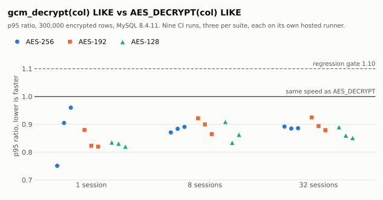

<p align="center">
  
</p>

<p align="center">
  <a href="#try-it">Try it</a> · <a href="#install">Install</a> · <a href="#functions">Functions</a> ·
  <a href="#does-it-actually-work">Evidence</a> · <a href="docs/design.md">Design</a> ·
  <a href="spec/envelope.md">Spec</a> · <a href="README-KO.md">한국어</a>
</p>

<p align="center">
  
  
  
  
  <a href="LICENSE"></a>
</p>

# mysql-gcm

**Encrypted columns you can still `LIKE`.**

Three SQL functions — `gcm_encrypt`, `gcm_encrypt_det`, `gcm_decrypt` — that add authenticated
AES-GCM to MySQL 8.0, 8.4 and 9.x as a server **component**. The decrypted value comes back tagged
`utf8mb4`, so `WHERE gcm_decrypt(name, @k) LIKE '%길%'` runs **inside the server** with MySQL's own
collation. Partial-match search on an encrypted Korean column is the reason this project exists.

**Pre-release. Nothing is published yet, and the construction has not had a human cryptographic
audit** — a scoped AI design review of two questions is recorded in `docs/design.md` A12
(constraint 13). Read the constraints below before you rely on it.

## Read this first — operational constraints

These are properties of the approach, not bugs, and the component cannot fix them. Full text and
rationale: [`docs/ops-constraints.md`](docs/ops-constraints.md), `docs/design.md` §6 and amendments.

| Theme | Constraints |
|---|---|
| **Topology** — replication, promotion, sharding | 1, 14, 15 |
| **Keys and nonces** — budget, rotation, AAD, recovery, key size | 7, 11, 12, 16 |
| **Query behaviour** — optimizer, what determinism leaks | 5, 6 |
| **Data and versions** — legacy envelopes, charset, sysvar scope, arguments | 8, 9, 10 |
| **Environment** — logs, managed services, my.cnf | 2, 3, 4 |
| **Scope of assurance** — what is checked and what is not | 13 |

1. **`gcm_encrypt` is non-deterministic: use ROW binlog.** Statement-based replication would compute
   a different nonce on the replica. Not usable in generated columns or indexes.
2. **Keys and plaintext are SQL arguments**, so they can reach the general and slow logs,
   `performance_schema` and an SBR binlog — `'%김%'` patterns too. Same exposure as `AES_ENCRYPT`.
3. **Self-managed MySQL only.** RDS, Aurora and Cloud SQL do not expose `plugin_dir`.
4. **Use `loose_` in my.cnf** (`loose_gcm.strict=ON`), or the server refuses to start before the
   component is installed.
5. **The functions are opaque to the optimizer.** `gcm_decrypt(col) LIKE` scans its candidates;
   selectivity must come from other predicates.
6. **`gcm_encrypt_det` reveals equality** of plaintexts. Join keys, `UNIQUE` and exact match only —
   never free text. It costs several times a plain seal to write.
7. **One AAD convention per key** for deterministic calls, across every server, column and
   application. Two AADs for one plaintext under one key reuse a nonce and allow forgery.
8. **Legacy `0x01` (CBC) envelopes are unauthenticated and must already be UTF-8.** Dual-read is for
   migrating; reject `0x01` afterwards. Encrypt text, not raw bytes, if it has to be searchable.
9. **`gcm.strict` is GLOBAL-only before MySQL 9.0.** `SET SESSION` works on 9.x only.
10. **Pass a stored value, not a computed expression.** On 8.0 and 8.4 some computed string arguments
    are stale from the second row on, so `gcm_encrypt_det(CONCAT(a, b), @k)` can seal the wrong
    bytes. Columns, literals, variables and bound parameters are safe (A7).
11. **Set a per-key usage budget and rotation plan before deploying**, summed across everything that
    shares the key. Generate keys independently per suite and domain; never resize one key into
    another. Deterministic AES-128 needs an approved budget, a finite use period and a retention
    horizon (A12). The component counts nothing and rotates nothing.
12. **Retries and restores are part of nonce management.** Copying an envelope is not a new
    encryption; never change only the AAD on a deterministic retry; do not roll back usage
    accounting with a restore. If RNG state is uncertain after recovery, stop writing.
13. **Validation is not monitoring, and tests are not a proof.** Nonce reuse, cross-call AAD policy
    and usage limits are not enforced. No human cryptographic audit has been done; the A12 AI review
    covers two design questions only. Review the construction and your deployment before production.
14. **Installing the component is not replicated.** Install it on every server that decrypts and on
    every replica that could be promoted.
15. **Shard on a stable identifier, never on ciphertext.** Comparing deterministic values across
    shards needs the same key, plaintext and AAD; count encryptions across every shard sharing a key.
16. **A truncated key silently picks a weaker cipher unless `gcm.min_key_bytes` stops it.** The key
    length selects the suite. The floor is GLOBAL, defaults to `32`, and is ignored by decryption,
    so raising it never locks out data.

## Support matrix

| MySQL | Built and tested against | `gcm.strict` scope | Constraint 10 reproduces for |
|:--|:--|:--|:--|
| **8.0** | 8.0.43 | GLOBAL | `REPEAT(str, int_col)`-shaped arguments |
| **8.4** | 8.4.11 | GLOBAL | `CONCAT(str, int_col)`-shaped arguments |
| **9.x** | 9.4.0 | GLOBAL **+ SESSION** | neither shape |

One artifact per MySQL major and architecture: a component links against the server it was built
for. Exact versions and digests: `docker/versions.json`.

## Try it

From a clone, with Docker — a MySQL 8.4 container with the component installed:

```sh
scripts/dev-up.sh 8.4                    # container mysql-dev-8.4
scripts/build-in-docker.sh 8.4           # -> build/8.4/component_gcm.so
docker cp build/8.4/component_gcm.so \
  mysql-dev-8.4:"$(docker exec mysql-dev-8.4 mysql -uroot -N -e 'SELECT @@plugin_dir')"component_gcm.so
docker exec -it mysql-dev-8.4 mysql -uroot -e "INSTALL COMPONENT 'file://component_gcm'"
docker exec -it mysql-dev-8.4 mysql -uroot
```

```sql
CREATE DATABASE demo; USE demo;
SET @k = UNHEX('000102030405060708090a0b0c0d0e0f101112131415161718191a1b1c1d1e1f');  -- public fixture key

CREATE TABLE patients (id INT AUTO_INCREMENT PRIMARY KEY, name_enc VARBINARY(128));
INSERT INTO patients (name_enc) VALUES (gcm_encrypt('홍길동', @k)), (gcm_encrypt('김철수', @k));

SELECT id, gcm_decrypt(name_enc, @k) AS name FROM patients
 WHERE gcm_decrypt(name_enc, @k) LIKE '%길%';     -- one row, 홍길동, matched inside the server
```

The stored value is `0x02 ‖ nonce ‖ ciphertext ‖ tag`. Change one byte of it and `gcm_decrypt`
raises an error instead of returning anything. To replay every integration scenario instead:
`scripts/verify.sh 8.4`.

## Install

**From source**, one major at a time: `scripts/build-in-docker.sh <8.0|8.4|9>` produces
`build/<major>/component_gcm.so`. Copy it into that server's `plugin_dir` (ask the server:
`SELECT @@plugin_dir`) and run `INSTALL COMPONENT 'file://component_gcm'` — on **every** server that
decrypts (constraint 14). A component built for 8.4 does not load into 9.x.

**From a release**, once one is published: six tarballs (three majors × amd64/arm64), `SHA256SUMS`
signed keylessly by the release workflow, and an SPDX SBOM. Verify the signature against this
repository's tagged workflow, then the checksums:

```sh
gh release download v<version> -R devgyurak/mysql-gcm
cosign verify-blob --certificate SHA256SUMS.pem --signature SHA256SUMS.sig \
  --certificate-identity-regexp '^https://github\.com/devgyurak/mysql-gcm/\.github/workflows/release\.yml@refs/tags/v' \
  --certificate-oidc-issuer https://token.actions.githubusercontent.com SHA256SUMS
sha256sum -c SHA256SUMS
```

Keep the `@refs/tags/v` part: without it the same command also accepts a signature from a branch or a
dry run. A release also publishes the server image `devgyurak/mysql-gcm-server`, tagged
`<version>-mysql<major>` and `mysql<major>` (amd64 + arm64): the official image with the component
installed on first start of a fresh data directory. There is no `latest` tag, since which major it
would mean is ambiguous.

## Functions

| Function | Returns | Use it for | Envelope (AES-256 / 192 / 128) |
|:--|:--|:--|:--|
| `gcm_encrypt(plaintext, key [, aad])` | `BLOB` | anything you only read back | random nonce: `0x02` / `0x06` / `0x04` |
| `gcm_encrypt_det(plaintext, key [, aad])` | `BLOB` | join keys, `UNIQUE`, exact match | synthetic nonce: `0x03` / `0x07` / `0x05` |
| `gcm_decrypt(ciphertext, key [, aad])` | `VARCHAR` `utf8mb4` | reading, and `LIKE` on the plaintext | reads `0x01`–`0x07` |

- **The key length selects the cipher, and nothing else does:** 32 bytes is AES-256-GCM, 24 is
  AES-192, 16 is AES-128. Any other length is an error on every call; `AES_ENCRYPT`'s key folding is
  deliberately not reproduced.
- **Anything below AES-256 is off by default.** `gcm.min_key_bytes` (GLOBAL, default `32`) refuses
  shorter keys on encryption; set `24` or `16` to allow the smaller suites (constraint 16).
- **A failed tag is an error** while `gcm.strict` is ON (the default) and NULL when it is OFF. A
  malformed envelope or a wrong key length is always an error.

Byte layout, failure codes and test vectors: [`spec/envelope.md`](spec/envelope.md).

## Does it actually work?

**It returns the right rows, rejects tampering, and filtering 300,000 encrypted rows server-side was
not slower than `AES_DECRYPT` in any CI run.** What that covers, and what it does not:

| Claim | Evidence | Limit |
|:--|:--|:--|
| Correct bytes | NIST CAVP KAT and every spec vector; 6,493 unit cases under ASan/UBSan | Conformance, not a security proof |
| Correct SQL on every major | 11 integration scenarios on 8.0, 8.4 and 9.x; MTR on 8.4; E2E with a replica | MTR results recorded on 8.4 only |
| Server-side `LIKE` is fast enough | `gcm_decrypt(col) LIKE` p95 **0.75–0.96×** `AES_DECRYPT` over 300k rows, nine CI runs across three suites | Hosted runners; a developer laptop measured above 1.0 at times. Re-measure on your hardware |
| No hidden per-call work | 60 gated core benchmarks against a straight-line OpenSSL implementation, five interleaved repetitions | Ratios, not absolute times |
| Plaintext stays off disk | `Created_tmp_disk_tables` unchanged in every load run | This workload; a sort or large `GROUP BY` can still spill |

<picture>
  <source media="(prefers-color-scheme: dark)" srcset="docs/assets/perf/load-ratio-dark.svg">
  
</picture>

Every point is one CI run's p95 ratio; below the solid line is faster than the builtin. The values,
run links and the data file behind this chart: `docs/perf.md` and
[`docs/assets/perf/load-ratios.json`](docs/assets/perf/load-ratios.json).

Two things worth knowing before you choose a function: **`gcm_encrypt_det` costs several times a
plain seal to write** (two HMAC passes), and **a smaller suite buys little speed** on hardware with
AES acceleration — pick it for interoperability, not performance. Every number, run link and caveat:
[`docs/perf.md`](docs/perf.md).

## Contribute

A change to the envelope, a function or a sysvar starts as an amendment to `docs/design.md` and lands
with `spec/`, unit and server tests in the same PR. Crypto paths need two reviewers.

| Layer | Run it |
|:--|:--|
| unit | `cmake -S tests/unit -B build/unit && cmake --build build/unit && ctest --test-dir build/unit` |
| integration | `scripts/verify.sh 8.0` · `8.4` · `9` |
| MTR | `scripts/mtr.sh 8.4` |
| E2E | `docker compose -f tests/e2e/compose.yml up --build --exit-code-from runner` |
| load | `python tests/load/run.py --rows 300000 --concurrency 1,8,32 --gate tests/load/baseline.json` |
| bench | `scripts/bench.sh --gate` |

[Design and amendments](docs/design.md) · [Envelope spec](spec/envelope.md) ·
[Operational constraints](docs/ops-constraints.md) · [Performance](docs/perf.md) ·
[Changelog](CHANGELOG.md). Working with an AI agent: start at `AGENTS.md` (or `CLAUDE.md`).

Applications call these functions through their existing MySQL driver; there is no client SDK.
Python in this repository is test, vector and documentation-chart tooling only.

## License

**GPLv2** — see [LICENSE](LICENSE). A MySQL component links against the server's GPLv2 headers;
`docs/design.md` §7 records the reasoning. Sources carry `SPDX-License-Identifier: GPL-2.0-only`.
